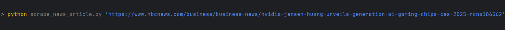
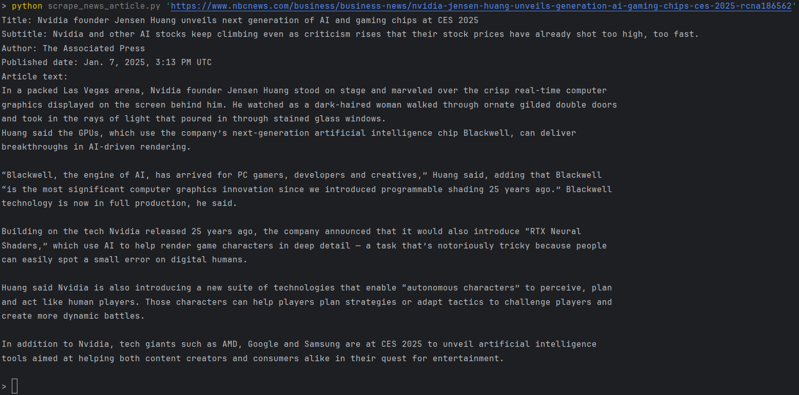

# DevProjects - Web scraper to get news article content

This is an open-source project from [DevProjects](http://www.codementor.io/projects).  
Find the project requirements here: [Web scraper to get news article content](https://www.codementor.io/projects/tool/web-scraper-to-get-news-article-content-atx32d46qe)

## Tech/framework used

Built with:
- Python
- `requests` library for making HTTP requests
- `BeautifulSoup` from `bs4` for web scraping and parsing HTML
- `argparse` for handling command-line arguments
- `textwrap` for formatting and wrapping article text


## Screenshots and demo

### Command in Terminal
Here is an image showing the command used in the terminal:



### Scraped Article Result
Below is an image showing the result of the scraped article:




## Installation

To install and run the scraper on your local machine, follow these steps:

1. Clone the repository:
   ```bash
   git clone https://github.com/arsha-cova/Web_scraper_news_article.git

2. Navigate into the project directory: 
    ```bash 
    cd Web_scraper_news_article
    ```
3. Install the required dependencies:
    ```bash 
   pip install -r requirements.txt
    ```
4. Run the scraper with the desired URL:
    ```bash 
   python scrape_news_article.py news_url
    ```


